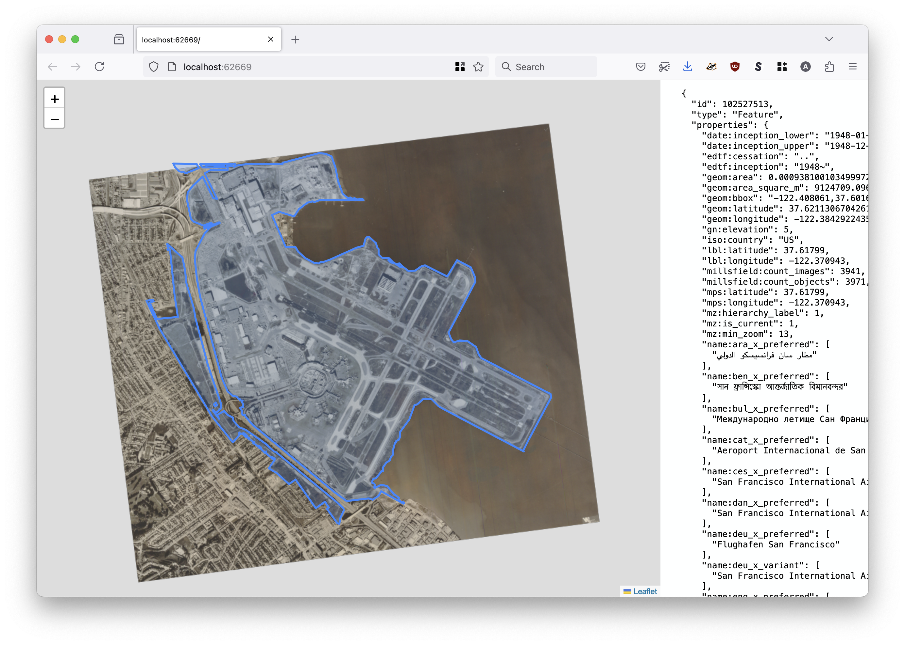
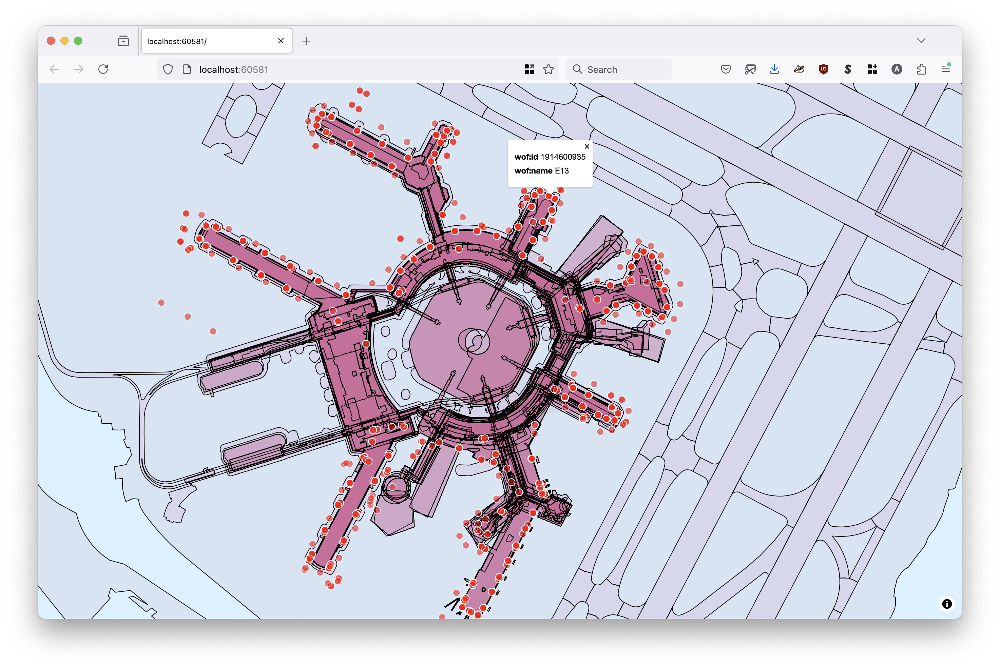
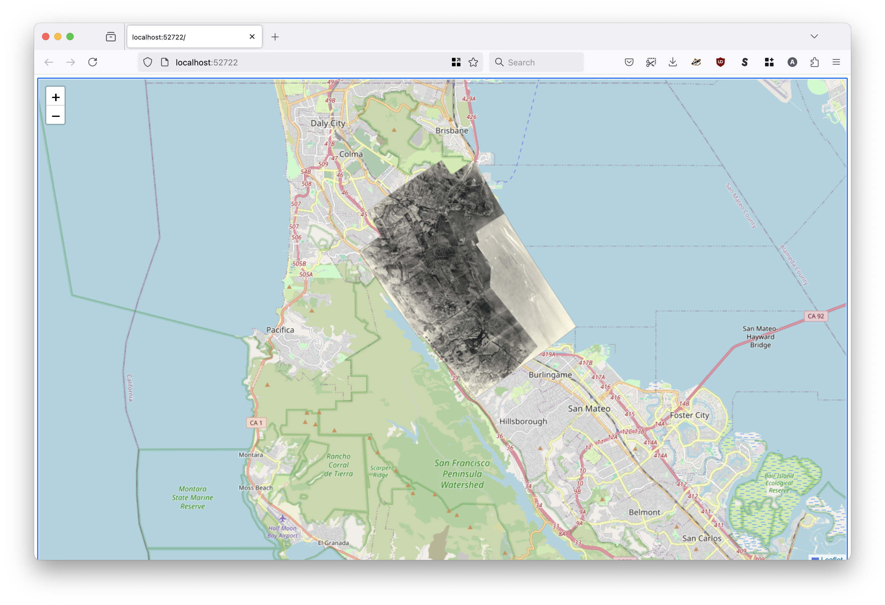

# go-geo-show

Command line tool wrapping the various `sfomuseum/go-{SOME_GEO_FORMAT}-show` tools.

## Motivation

This package exports a single command-line tool called `show` which wraps a variety of standalone tools for displaying different geo formats in a web browser.

Each one of those tools can be run independently of one another, by design, and this tool bundles them all in to a single (larger) binary application for the sake of convenience..

## Tools

```
$> make cli
go build -tags geojson,geoparquet,mbtiles,pmtiles -mod vendor -ldflags="-s -w" -o bin/show cmd/show/main.go
```

### Build tags

Individual geo format tools are enabled through the use of Go language build tags. By default the `cli` Makefile target will build a binary with support for all the available formats.

This includes support for GeoParquet files through the use of the [marcboeker/go-duckdb](https://github.com/marcboeker/go-duckdb) package which adds an extra wrinkle to the build step. The `go-duckdb` package bundles all the `libduckdb.a` files which, taken as a whole, are prohibitive to vendor in this package so they are expicitly excluded and you will need to fetch them manually. The easiest way to deal with this is to install the [goware/modvendor](https://github.com/goware/modvendor) package and run the following command before building the `show` binary:

```
$> modvendor -copy="**/*.a **/*.h" -v
```

The `go-geoparquet-show` package depends on `marcboeker/go-duckdb` v1.8.5. There is new major version (v2) of `go-duckdb` which appears to have new build instructions but these have not been tested tet.

### show

```
$> ./bin/show -h
Usage: show [CMD] [OPTIONS]
Valid commands are:
* geojson
* geoparquet
* mbtiles
* pmtiles
```

#### geojson

```
$> ./bin/show geojson -h
Command-line tool for serving GeoJSON features from an on-demand web server.
Usage:
	 ./bin/show geojson path(N) path(N)
Valid options are:
  -browser-uri string
    	A valid sfomuseum/go-www-show/v2.Browser URI. Valid options are: web:// (default "web://")
  -label value
    	Zero or more (GeoJSON Feature) properties to use to construct a label for a feature's popup menu when it is clicked on.
  -map-provider string
    	Valid options are: leaflet, protomaps (default "leaflet")
  -map-tile-uri string
    	A valid Leaflet tile layer URI. See documentation for special-case (interpolated tile) URIs. (default "https://tile.openstreetmap.org/{z}/{x}/{y}.png")
  -point-style string
    	A custom Leaflet style definition for point geometries. This may either be a JSON-encoded string or a path on disk.
  -port int
    	The port number to listen for requests on (on localhost). If 0 then a random port number will be chosen.
  -protomaps-theme string
    	A valid Protomaps theme label. (default "white")
  -style string
    	A custom Leaflet style definition for geometries. This may either be a JSON-encoded string or a path on disk.

If the only path as input is "-" then data will be read from STDIN.
```

##### Example



```
$> ./bin/show geojson \
	/usr/local/data/sfomuseum-data-architecture/data/102/527/513/102527513.geojson \
	/usr/local/data/oak.geojson
	
2024/08/13 13:08:44 Features are viewable at http://localhost:54501
```

Consult the [sfomuseum/go-geojson-show](https://github.com/sfomuseum/go-geojson-show?tab=readme-ov-file#examples) package for detailed usage examples.

#### geoparquet

```
$> ./bin/show geoparquet -h
Command-line tool for serving GeoParquet features as vector tiles from an on-demand web server.
Usage:
	 ./bin/show geoparquet [options]
Valid options are:
  -browser-uri string
    	A valid sfomuseum/go-www-show/v2.Browser URI. Valid options are: web:// (default "web://")
  -data-source string
    	The URI of the GeoParquet data. Specifically, the value passed to the DuckDB read_parquet() function.
  -database-engine string
    	The database/sql engine (driver) to use. (default "duckdb")
  -label value
    	Zero or more (GeoJSON Feature) properties to use to construct a label for a feature's popup menu when it is clicked on.
  -max-x-column string
    	An option column name to use for a initial bounding box constraint. This columns is expected to contain the maximum X (longitude) value of the geometry it is associated with. This will only work if the -max-y-column flag is also set.
  -max-y-column string
    	An option column name to use for a initial bounding box constraint. This columns is expected to contain the maximum Y (latitude) value of the geometry it is associated with. This will only work if the -max-x-column flag is also set.
  -port int
    	The port number to listen for requests on (on localhost). If 0 then a random port number will be chosen.
  -renderer string
    	Which rendering library to use to draw vector tiles. Valid options are: leaflet, maplibre. (default "leaflet")
  -verbose
    	Enable vebose (debug) logging.
```

##### Example



```
$> ./bin/show geoparquet \
	-data-source /usr/local/data/arch.geoparquet \
	-label wof:id \
	-label wof:name \
	-renderer maplibre
	
2024/08/21 13:40:52 INFO Server is ready and features are viewable url=http://localhost:60581
```

Consult the [sfomuseum/go-geoparquet-show](https://github.com/sfomuseum/go-geoparquet-show?tab=readme-ov-file#examples) package for detailed usage examples.

#### mbtiles

```
$> ./bin/show mbtiles -h
Command-line tool for serving MBTiles tiles from an on-demand web server.
Usage:
	 ./bin/show mbtiles [options]
Valid options are:
  -base-tile-uri string
    	A valid raster tile layer or pmtiles:// URI. (default "https://tile.openstreetmap.org/{z}/{x}/{y}.png")
  -browser-uri string
    	A valid sfomuseum/go-www-show/v2.Browser URI. Valid options are: web:// (default "web://")
  -map-provider string
    	The map provider to use for a base layer. Valid options are: leaflet, maplibre, protomaps (default "maplibre")
  -port int
    	The port number to listen for requests on (on localhost). If 0 then a random port number will be chosen.
  -protomaps-theme string
    	A valid Protomaps theme label. (default "white")
  -raster value
    	Zero or more {LAYER_NAME}={PATH} pairs referencing MBTiles databases containing raster data.
  -vector value
    	Zero or more {LAYER_NAME}={PATH} pairs referencing MBTiles databases containing vector (MVT) data.
  -verbose
    	Enable verbose (debug) logging.
```

##### Example


```
$> ./bin/show geojson \
	-map-provider leaflet \
	-raster 2023=/usr/local/sfomuseum/tiles/sqlite/2023.db \
	-raster 2024=/usr/local/sfomuseum/tiles/sqlite/2024.db \
	-verbose
	
2024/08/30 18:16:14 DEBUG Verbose logging enabled
2024/08/30 18:16:14 DEBUG Start server
2024/08/30 18:16:14 DEBUG HEAD request succeeded url=http://localhost:64211
2024/08/30 18:16:14 INFO Server is ready and features are viewable url=http://localhost:64115
2024/08/30 18:16:22 DEBUG Tile data is nil path=/tiles/2023/12/654/2511.png layer=2023
2024/08/30 18:16:22 DEBUG Tile data is nil path=/tiles/2023/12/655/2511.png layer=2023
2024/08/30 18:16:22 DEBUG Tile data is nil path=/tiles/2023/12/656/2511.png layer=2023
2024/08/30 18:16:22 DEBUG Serve tile path=/tiles/2023/12/655/2510.png layer=2023 "content type"=image/png length=49883
2024/08/30 18:16:22 DEBUG Tile data is nil path=/tiles/2023/12/654/2510.png layer=2023
2024/08/30 18:16:22 DEBUG Tile data is nil path=/tiles/2023/12/656/2510.png layer=2023
2024/08/30 18:16:22 DEBUG Tile data is nil path=/tiles/2023/12/655/2512.png layer=2023
... and so on
```

Consult the [sfomuseum/go-mbtiles-show](https://github.com/sfomuseum/go-mbtiles-show?tab=readme-ov-file#examples) for detailed usage examples.

#### pmtiles

```
$> ./bin/show pmtiles -h
Command-line tool for serving PMTiles tiles from an on-demand web server.
Usage:
	 ./bin/show pmtiles [options]
Valid options are:
  -browser-uri string
    	A valid sfomuseum/go-www-show/v2.Browser URI. Valid options are: web:// (default "web://")
  -initial-view string
    	A comma-separated string indicating the map's initial view. Valid options are: 'LON,LAT', 'LON,LAT,ZOOM' or 'MINX,MINY,MAXX,MAXY'.
  -leaflet_point_style string
    	A custom Leaflet style definition for points. This may either be a JSON-encoded string or a path on disk.
  -leaflet_style string
    	A custom Leaflet style definition for geometries. This may either be a JSON-encoded string or a path on disk.
  -map-provider string
    	Valid options are: leaflet, protomaps (default "leaflet")
  -map-tile-uri string
    	A valid Leaflet tile layer URI. See documentation for special-case (interpolated tile) URIs. (default "https://tile.openstreetmap.org/{z}/{x}/{y}.png")
  -port int
    	The port number to listen for requests on (on localhost). If 0 then a random port number will be chosen.
  -protomaps-theme string
    	A valid Protomaps theme label (for the base map not individual PMTiles databases). (default "white")
  -raster value
    	Zero or more {LAYER_NAME}={PATH} pairs referencing PMTiles databases containing raster data.
  -vector value
    	Zero or more {LAYER_NAME}={PATH} pairs referencing PMTiles databases containing vector (MVT) data.
  -verbose
    	Enable verbose (debug) logging.
```

##### Example



```
$> ./bin/show pmtiles \
	-initial-view -122.408061,37.601617,-122.354907,37.640167 \
	-raster test=fixtures/1930-raster.pmtiles
	
2025/03/12 14:36:38 INFO Server is ready and features are viewable url=http://localhost:52722
```

Consult the [sfomuseum/go-pmtiles-show](https://github.com/sfomuseum/go-pmtiles-show?tab=readme-ov-file#examples) package for detailed usage examples.

## See also

* https://github.com/sfomuseum/go-geojson-show
* https://github.com/sfomuseum/go-geoparquet-show
* https://github.com/sfomuseum/go-mbtiles-show
* https://github.com/sfomuseum/go-pmtiles-show